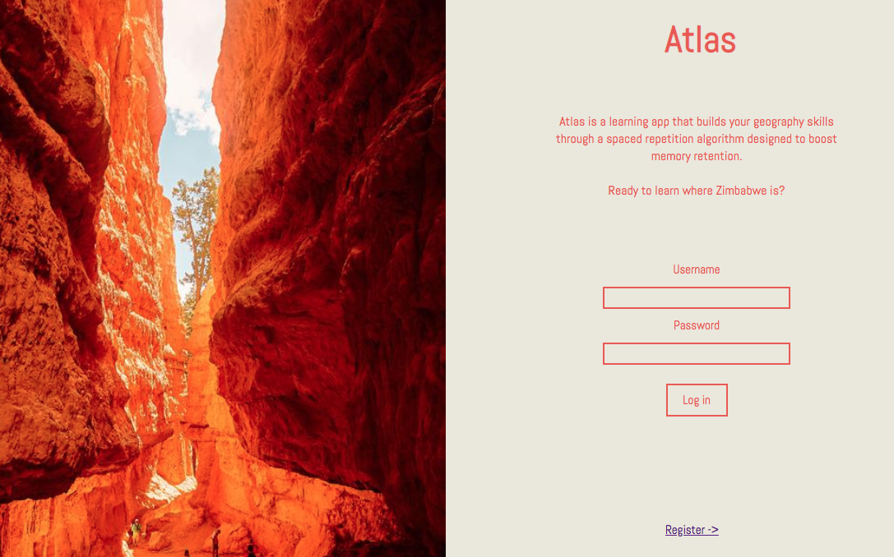

# Atlas

### Spaced Reptition Learning

Atlas is a learning app that utilizes a spaced-repitition algorithm to help users learn geography.

### Links

[Server-Side Repo](https://github.com/thinkful-ei22/morgan-cecille-spaced-rep-server)

[Live app](https://countries-client.herokuapp.com/dashboard)

Demo username:  _demouser_    
Demo password:  _password_

### Tech-Stack

- Frontend: React, React-Router, Redux, Redux-Form, Redux-Thunk, Enzyme & Jest for testing

- Backend: Node/Express app with user authentication using BCrypt and JSON Web Tokens, passport.js, CORS, and Mocha & Chai for testing.  The spaced-repetition algorithm utilizes a Linked-List behavior to show users questions in an optimized, sequential order.

### Screenshots

###### Landing Page

###### User Dashboard

###### Gameplay

###### Instant Feedback

###### Mobile Views

 

